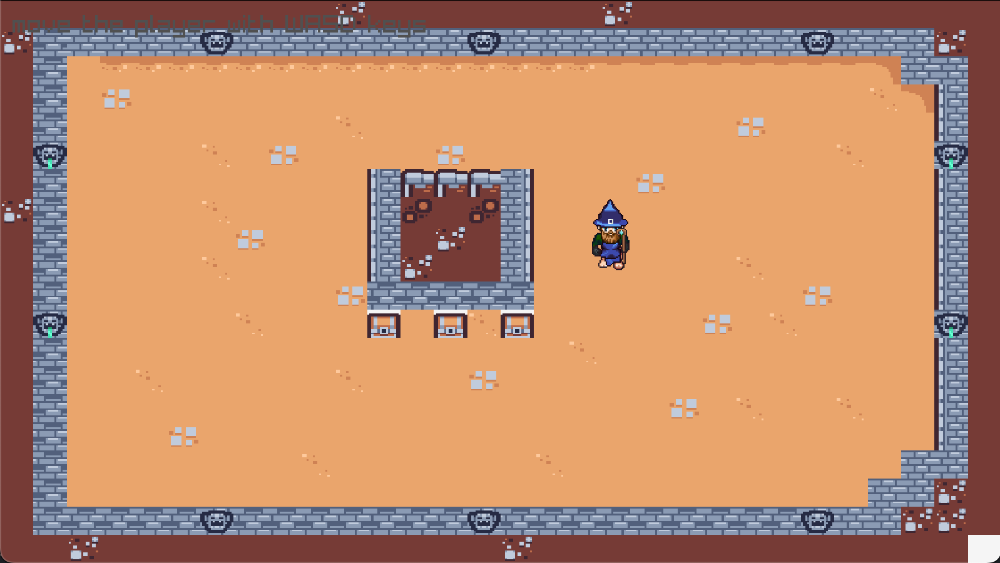

# Compiling
1. source .env
2. make
3. Done

# Roadmap
1. Make game somehow playable with animations, skill tree, enemies, map generator(Dynamically change map on events)
2. Support multiplayer on single machine
3. Support multiplayer via network

# Progress
Current Image of game
- No Collision
- Only Player movement and drawing of map

# Open TODO's
- Getting rid of magic numbers

# Credit
Check sheet-credits.csv
